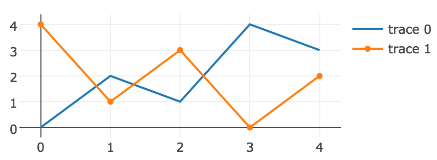

[](https://badge.fury.io/rb/rbplotly)
[](https://travis-ci.org/ash1day/rbplotly)
[](https://codeclimate.com/github/ash1day/rbplotly/coverage)
[](https://codeclimate.com/github/ash1day/rbplotly)

# Rbplotly

Rbplotly, a Ruby visualization library, allows you to create interactive plots.

## Installation

Add this line to your application's Gemfile:

```ruby
gem 'rbplotly'
```

And then execute:

    $ bundle

Or install it yourself as:

    $ gem install rbplotly

## Usage

```ruby
require 'rbplotly'

x = [0, 1, 2, 3, 4]
trace0 = { x: x, y: [0, 2, 1, 4, 3], type: :scatter, mode: :lines }
trace1 = { x: x, y: [4, 1, 3, 0, 2], type: :scatter, mode: :'markers+lines' }
data = [trace0, trace1] # data must be an array

layout = { width: 500, height: 500 }

plot = Plotly::Plot.new(data: data, layout: layout)

plot.layout.height = 300 # You can assign plot's attributes.

plot.generate_html(path: './line_chart.html')
```



Use `#download_image` if you want to get an image by using Plot.ly API. You can get your API KEY [here](https://plot.ly/settings/api).

```ruby
Plotly.auth(<YOUR_USERNAME>, <YOUR_API_KEY>)
plot.download_image(path: './line_chart.png')
```

Or use `#show` on IRuby notebooks.

```ruby
plot.show
```

## Examples

- [Basic Usage](https://nbviewer.jupyter.org/github/ash1day/rbplotly/blob/master/examples/Basic%20Usage.ipynb)
- [Bar Charts](https://nbviewer.jupyter.org/github/ash1day/rbplotly/blob/master/examples/Bar%20%20Charts.ipynb)
- [Scatter Plots](https://nbviewer.jupyter.org/github/ash1day/rbplotly/blob/master/examples/Scatter%20Plots.ipynb)
- [Line Charts](https://nbviewer.jupyter.org/github/ash1day/rbplotly/blob/master/examples/Line%20charts.ipynb)
- [Pie Charts](https://nbviewer.jupyter.org/github/ash1day/rbplotly/blob/master/examples/Pie%20Charts.ipynb)
- [Histograms](https://nbviewer.jupyter.org/github/ash1day/rbplotly/blob/master/examples/Histograms.ipynb)
- [Heatmaps](https://nbviewer.jupyter.org/github/ash1day/rbplotly/blob/master/examples/heatmaps.ipynb)

Visit [here](https://nbviewer.jupyter.org/github/ash1day/rbplotly/tree/master/examples/) to see more examples.

## Contributing

1. Fork it
2. Create your feature branch (`git checkout -b my-new-feature`)
3. Commit your changes (`git commit -am 'Add some feature'`)
4. Push to the branch (`git push origin my-new-feature`)
5. Create new Pull Request

### About RuboCop

We don't use RuboCop.

## Thanks

`rbplotly` is based on [plotly/plotly.py](https://github.com/plotly/plotly.py), so there are a lot of code coming from it.

## License

Copyright (c) 2016 Yoshihiro Ashida. See [LICENSE.txt](LICENSE.txt) for
further details.
