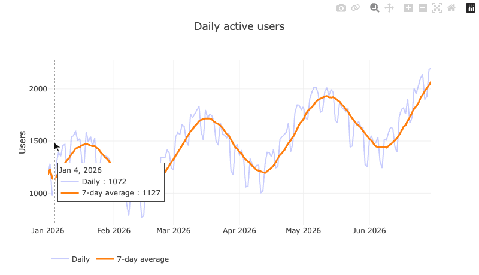
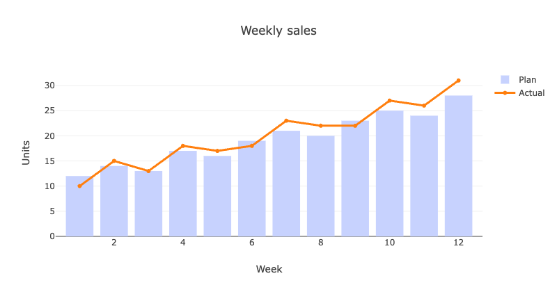
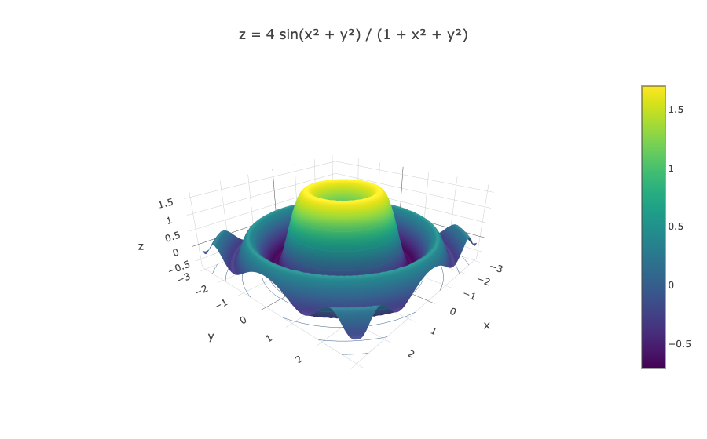
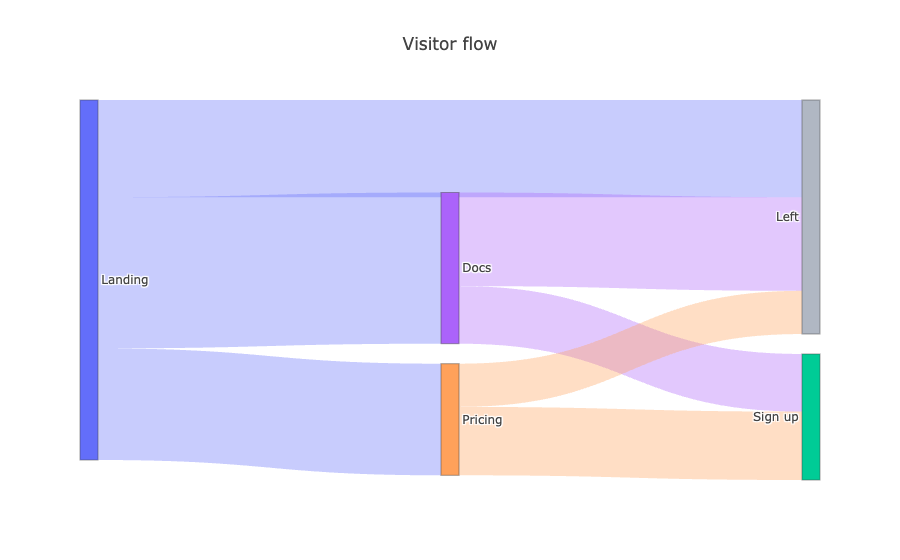
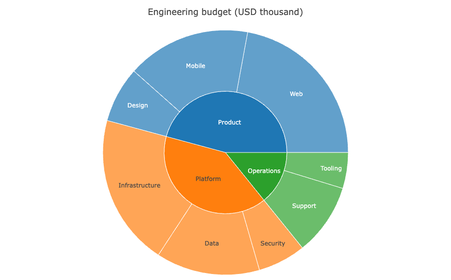
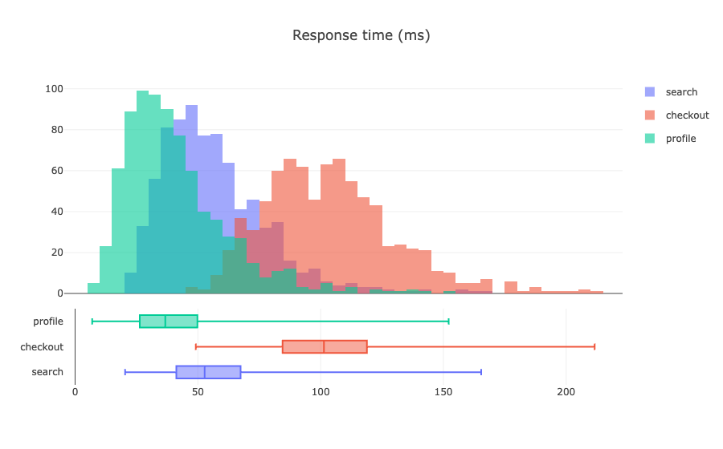

# rbplotly

[](https://rubygems.org/gems/rbplotly)
[](https://github.com/ash1day/rbplotly/actions/workflows/ci.yml)

**Interactive [Plotly.js](https://plotly.com/javascript/) charts from Ruby.** Hover, zoom and
pan in the browser, from a few lines of plain Ruby, in a single HTML file you can send anyone.



## Why rbplotly

- **All of plotly.js, nothing invented.** Every chart type (47 of them, from bar charts to 3D
  surfaces, Sankey diagrams and maps) and every attribute in the
  [plotly.js reference](https://plotly.com/javascript/reference/) works as written there.
  Plotly publishes no Ruby library; rbplotly is that missing layer.
- **Mistakes stop at the line that made them.** Figures are checked against the schema of the
  bundled plotly.js release, so a typo raises an error with the attribute path and a
  suggestion instead of producing a chart that silently ignores it.
- **Nothing to sign up for.** Output is HTML: one self-contained file that works offline, a
  fragment for a Rails view, or inline output in Jupyter. No account, API key or server.

## Quick start

```sh
gem install rbplotly   # Ruby 3.3+; or add gem "rbplotly" to your Gemfile
```

```ruby
require "rbplotly"

weeks = (1..12).to_a
plan = [12, 14, 13, 17, 16, 19, 21, 20, 23, 25, 24, 28]
actual = [10, 15, 13, 18, 17, 18, 23, 22, 22, 27, 26, 31]

fig = Plotly::Figure.new
  .add_bar(x: weeks, y: plan, name: "Plan", marker_color: "#c7d2fe")
  .add_scatter(x: weeks, y: actual, name: "Actual", mode: :"lines+markers", line_width: 3)
  .update_layout(title_text: "Weekly sales", xaxis_title_text: "Week",
    yaxis_title_text: "Units", hovermode: "x unified")

fig.write_html("sales.html") # add open: true to open it in your browser
```



`sales.html` is a single file with plotly.js embedded: open it offline, attach it to an email,
or publish it as is.

## Mistakes stop where you made them

```ruby
fig.add_scatter(x: [1, 2], y: [3, 1], mode: :line)
# => Plotly::ValidationError: data[2].mode: "line" is not a flag of mode. Did you mean "lines"?
#    Join "lines", "markers", "text" with "+", or use "none"
fig.update_layout(barmode: :stacked)
# => Plotly::ValidationError: layout.barmode: "stacked" is not one of "stack", "group",
#    "overlay", "relative". Did you mean "stack"?
fig.add_bar(y: [1], marker_colour: "red")
# => Plotly::ValidationError: data[2].marker.colour: marker has no attribute "colour".
#    Did you mean "color"?
fig.update_layout(title: "Sales")
# => Plotly::ValidationError: layout.title: expected a Hash of title attributes, got "Sales".
#    Plotly.js no longer accepts a plain string here:
#    use title: {text: "Sales"} or title_text: "Sales"
```

Validation covers attribute names, enumerated values, flag lists, booleans and number ranges.
It is stricter than plotly.js on purpose: values that plotly.js would quietly replace with a
default are reported instead. Colors, data arrays and free-form values are passed through.
Of the 1308 test figures in plotly.js itself, 1204 pass; the rest contain such ignored input. If you need an attribute from a
newer plotly.js than the bundled one, turn validation off for that figure:
`Plotly::Figure.new(validate: false)`.

## Gallery

<table>
  <tr>
    <td><a href="https://ash1day.github.io/rbplotly/#surface"></a></td>
    <td><a href="https://ash1day.github.io/rbplotly/#sankey"></a></td>
  </tr>
  <tr>
    <td><a href="https://ash1day.github.io/rbplotly/#sunburst"></a></td>
    <td><a href="https://ash1day.github.io/rbplotly/#distributions"></a></td>
  </tr>
</table>

**[See every example running, next to its code →](https://ash1day.github.io/rbplotly/)**

## Building figures

A figure has traces (`data`), a `layout` and a plotly.js `config`. Attribute names are those
of the [plotly.js reference](https://plotly.com/javascript/reference/); rbplotly adds no names
of its own.

```ruby
fig = Plotly::Figure.new(
  data: [{type: :bar, x: %w[A B C], y: [3, 1, 2]}],
  layout: {title: {text: "Votes"}, height: 400}
)

# One add_<type> helper per trace type: add_scatter, add_bar, add_heatmap, add_sankey, ...
fig.add_scatter(x: %w[A B C], y: [2, 2, 2], mode: :lines, name: "Target")

# Underscores reach into nested attributes:
# marker_line_width: 2 is marker: {line: {width: 2}}
fig.update_traces({marker_color: "teal", marker_line_width: 1}, selector: {type: :bar})
fig.update_layout(yaxis_range: [0, 4], legend_orientation: "h")
```

Names that contain an underscore themselves (`error_x`, `paper_bgcolor`) keep working.
Updates merge into what is already there.

### Subplots

```ruby
fig = Plotly.make_subplots(rows: 1, cols: 2, subplot_titles: ["Revenue", "Users"])
fig.add_bar(x: %w[Q1 Q2 Q3], y: [10, 12, 15], row: 1, col: 1)
fig.add_scatter(x: %w[Q1 Q2 Q3], y: [200, 260, 310], row: 1, col: 2)
fig.update_yaxes({title_text: "USD (M)"}, row: 1, col: 1)
```

`shared_xaxes:` and `shared_yaxes:` link the axes of a column or row so they zoom together.
Traces on x/y axes go on the cell's axes and domain traces (pie, sunburst, ...) fill the cell;
3D, polar, ternary and map traces cannot be placed by `row:`/`col:` yet.

## Output

| Method | Gives you |
| --- | --- |
| `fig.write_html(path)` | A standalone page with plotly.js embedded (works offline). `include_plotlyjs: :cdn` makes it ~5 MB smaller. |
| `fig.to_html` | An HTML fragment (`<div>` + `<script>`) that loads the pinned plotly.js from the CDN. |
| `fig.show` | The chart inline in a Jupyter notebook ([IRuby](https://github.com/SciRuby/iruby)), or in your browser otherwise. |
| `fig.to_json` / `fig.to_h` | The figure as plotly.js reads it, for your own front end or `Plotly.newPlot`. |

`include_plotlyjs:` accepts `:cdn`, `:inline`, `false` (the page already loads plotly.js) or a
URL. `to_html` also takes `div_id:`, `width:` and `height:` (Integers are pixels; the default
is the layout height, or 450px). Charts resize with their container.

### In a Rails view

```erb
<%# Load plotly.js once in your layout, before this (not deferred), then: %>
<%= raw @figure.to_html(include_plotlyjs: false, height: 400) %>
```

All strings in the figure are escaped for use inside `<script>`, so user-provided labels such
as `"</script>"` cannot break out of the page.

### In Jupyter

With [IRuby](https://github.com/SciRuby/iruby), the last expression of a cell is displayed,
or call `fig.show`. plotly.js is loaded from the CDN once per notebook, without RequireJS
(which JupyterLab does not have, and which kept 0.x charts from showing there). Checked with
JupyterLab 4.6 and IRuby 0.8.

## Data

Any of these can be used where plotly.js expects an array or a value:

- Arrays, Ranges (`x: 1..100`), Sets, Enumerators, and objects with `#to_a` such as
  `Numo::NArray`, `Polars::Series` or `Daru::Vector`
- `Date` and `Time` (written as `"2026-10-06 09:30:00"`; plotly.js has no time zones, so it
  shows the wall-clock time you give it)
- `Float::NAN` and infinities (written as `null`, which plotly.js draws as a gap)
- `BigDecimal` and `Rational` (written as floats), Symbols (written as strings)

Map traces that draw country outlines (`scattergeo`, `choropleth`) load them from Plotly's
CDN. Since plotly.js 3.1 those outlines come from
[UN Geodata](https://plotly.com/blog/improved-map-accuracy-plotlyjs-un-geodata/), which has
its own terms of use (attribution to the UN; no commercial use); check them before you publish
such a map.

## plotly.js version

rbplotly 1.0 targets **plotly.js 4.1.2** (`Plotly::PLOTLY_JS_VERSION`). The CDN URL, the
embedded copy and the validation schema all come from that release, so what passes
validation is what the browser draws. New plotly.js releases ship as new rbplotly versions.

## Not included

- **Static images (PNG/SVG/PDF).** Use the camera button in the chart's toolbar, or
  `Plotly.toImage` in the browser. (The 0.x `download_image` used the plot.ly cloud API,
  which no longer exists.)
- **A high-level "plot this data frame" API.** For seaborn-style statistical charts, see
  [charty](https://github.com/red-data-tools/charty). rbplotly stays a faithful, typed layer
  over plotly.js.

## Upgrading from 0.x

1.0 is a rewrite. `Plotly::Plot.new(data:, layout:)` still works and prints a deprecation
warning; `generate_html(path:)` is now `write_html(path)`. Attribute objects
(`plot.layout.height = 300`) are replaced by `update_layout(height: 300)`, and
`Plotly.auth` / `download_image` are removed. See [CHANGELOG.md](CHANGELOG.md).

## Development

```sh
git clone https://github.com/ash1day/rbplotly.git && cd rbplotly
bin/setup              # bundle install + download the pinned plotly.js
bundle exec rake       # specs + Standard (lint)
bundle exec rake spec:browser  # draws generated HTML in headless Chrome (needs Chrome)
bundle exec rake gallery       # builds the gallery into site/
```

No API keys or accounts are needed to run anything. To move to a new plotly.js release, change
`PLOTLY_JS_VERSION` in `lib/plotly/version.rb`, put the output of `rake plotlyjs:checksum` into
`rakelib/plotlyjs.rake`, run `rake schema:generate`, and review the schema diff.
More in [CONTRIBUTING.md](CONTRIBUTING.md).

## License

[MIT](LICENSE.txt). plotly.js, bundled in the gem, is © Plotly, Inc. and also MIT-licensed.
